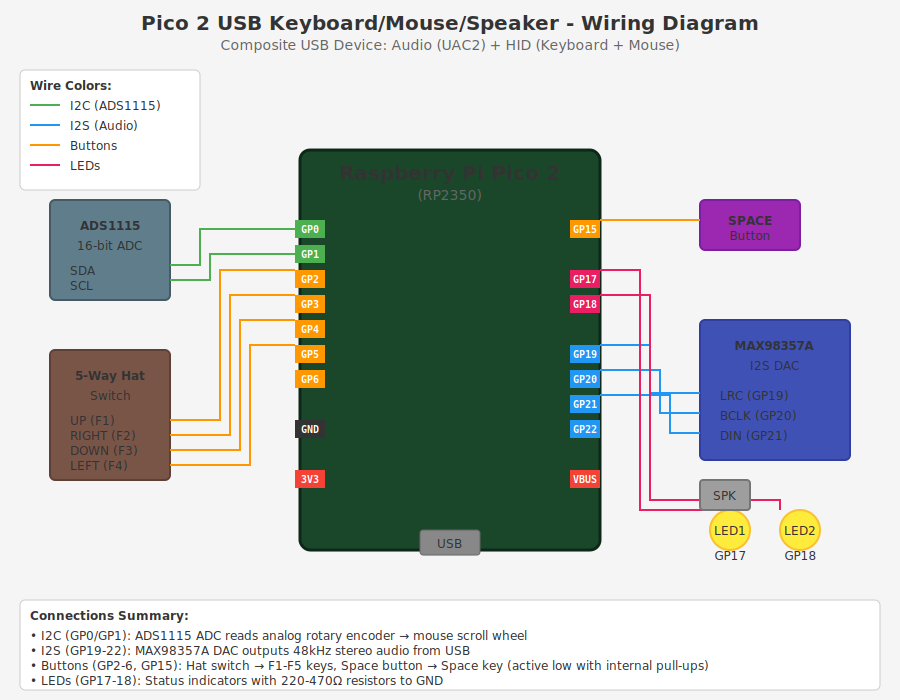

# Pico 2 USB Keyboard/Mouse/Speaker

A composite USB device firmware for the Raspberry Pi Pico 2 (RP2350) that combines:
- **USB Audio Class 2.0 (UAC2)** - High-quality 48kHz stereo speaker output via I2S DAC
- **HID Keyboard** - 6 programmable buttons (5-way hat switch + space button)
- **HID Mouse** - Scroll wheel via analog rotary encoder

This project creates a single USB device that appears to the host computer as three devices simultaneously: an audio speaker, a keyboard, and a mouse.



## Features

- **USB Audio Speaker**: 48kHz stereo audio output supporting 16-bit, 24-bit, and 32-bit formats
- **Asynchronous USB Audio**: Proper feedback endpoint for glitch-free playback
- **HID Keyboard**: Hat switch buttons mapped to F1-F5 keys, plus a dedicated Space button
- **HID Mouse Scroll**: Analog rotary encoder (via ADS1115 ADC) mapped to mouse scroll wheel
- **Status LEDs**: Two external LEDs for visual feedback
- **Non-blocking Design**: All I/O operations are non-blocking to ensure smooth audio playback

## Hardware Requirements

### Core Components
| Component | Description |
|-----------|-------------|
| Raspberry Pi Pico 2 | RP2350-based microcontroller board |
| MAX98357A | I2S DAC amplifier module |
| ADS1115 | 16-bit I2C ADC for rotary encoder |
| 5-way Hat Switch | Navigation buttons (or 5 individual buttons) |
| Momentary Button | Space key button |
| Analog Rotary Encoder | Potentiometer-style encoder with analog output |
| 2x LEDs | Status indicator LEDs |
| 2x 220-470Ω Resistors | Current limiting for LEDs |
| Speaker | 4Ω or 8Ω speaker for audio output |

### Pin Connections

#### I2C - ADS1115 (Rotary Encoder ADC)
| Pico Pin | ADS1115 Pin | Function |
|----------|-------------|----------|
| GP0 | SDA | I2C Data |
| GP1 | SCL | I2C Clock |
| 3V3 | VCC | Power |
| GND | GND | Ground |

#### Hat Switch Buttons
| Pico Pin | Function | HID Key |
|----------|----------|---------|
| GP2 | UP | F1 |
| GP3 | RIGHT | F2 |
| GP4 | DOWN | F3 |
| GP5 | LEFT | F4 |
| GP6 | CENTER | F5 |
| GND | Common | - |

All buttons use internal pull-ups. Wire each button between GPIO and GND.

#### Space Button
| Pico Pin | Function | HID Key |
|----------|----------|---------|
| GP15 | Button | Space |
| GND | Other side | - |

#### Status LEDs
| Pico Pin | Function | Notes |
|----------|----------|-------|
| GP17 | LED 1 Anode | Always on at 25% brightness |
| GP18 | LED 2 Anode | Blinks when buttons pressed |
| GND | Cathodes | Via 220-470Ω resistors |

#### I2S - MAX98357A (Audio DAC)
| Pico Pin | MAX98357A Pin | Function |
|----------|---------------|----------|
| GP19 | LRC | Left/Right Clock (LRCLK) |
| GP20 | BCLK | Bit Clock |
| GP21 | DIN | Data In |
| GP22 | - | MCLK (optional) |
| VBUS (5V) | VIN | Power |
| GND | GND | Ground |
| 3V3 | SD | Enable (or leave floating) |

## Software Dependencies

This project requires external libraries that must be obtained separately:

### Required Libraries
1. **pico-sdk** - Raspberry Pi Pico SDK
2. **picoamp-2** - USB Audio library with custom TinyUSB fork
   - Repository: https://github.com/sctanf/picoamp-2
   - Contains the `pico-i2s-pio` library for I2S output
   - Contains a patched TinyUSB with RP2040/RP2350 USB audio fixes

### Why picoamp-2?

The standard pico-sdk TinyUSB has issues with USB Audio Class 2.0 on RP2040/RP2350:
- Timeout errors (-110) during device configuration
- Protocol errors (-71) during audio streaming
- Unreliable feedback endpoint behavior

The picoamp-2 project uses a [custom TinyUSB fork](https://github.com/sctanf/tinyusb/tree/rp2040-fixes) that fixes these issues.

## Building

### 1. Clone the required repositories

```bash
# Clone pico-sdk
git clone https://github.com/raspberrypi/pico-sdk.git
cd pico-sdk
git submodule update --init
cd ..

# Clone picoamp-2 (for libraries)
git clone https://github.com/sctanf/picoamp-2.git

# Clone this project
git clone https://github.com/YOUR_USERNAME/pico2-usb-keyboard-mouse-speaker.git
```

### 2. Copy required files into this project

```bash
cd pico2-usb-keyboard-mouse-speaker

# Copy pico_sdk_import.cmake
cp ../picoamp-2/pico_sdk_import.cmake .

# Create lib directory and copy libraries
mkdir -p lib
cp -r ../picoamp-2/lib/pico-i2s-pio lib/
cp -r ../picoamp-2/lib/tinyusb lib/
```

### 3. Build the firmware

```bash
mkdir build
cd build
PICO_SDK_PATH=../../pico-sdk cmake ..
make -j4
```

### 4. Flash to Pico 2

1. Hold the BOOTSEL button on the Pico 2
2. Connect USB cable while holding BOOTSEL
3. Release BOOTSEL - Pico appears as a USB drive
4. Copy `picoamp_hid.uf2` to the drive

## Usage

### Audio Output
Once connected, the device appears as "Pico Amp 2 + HID" audio device. Select it as your audio output in your operating system's sound settings.

**Linux:**
```bash
# List audio devices
aplay -l

# Test audio
speaker-test -D hw:1,0 -c 2 -t sine
```

**Windows/macOS:**
Select "Pico Amp 2 + HID" in Sound Settings.

### Keyboard Buttons
| Button | Key Sent |
|--------|----------|
| Hat UP | F1 |
| Hat RIGHT | F2 |
| Hat DOWN | F3 |
| Hat LEFT | F4 |
| Hat CENTER | F5 |
| Space Button | Space |

### Mouse Scroll Wheel
The analog rotary encoder is read via the ADS1115 ADC. Turning the encoder sends mouse scroll events.

**Adjusting Sensitivity:**
Edit `ROTARY_THRESHOLD` in `main.c`:
- Higher value = less sensitive (more rotation needed)
- Lower value = more sensitive
- Default: 3000

## Technical Details

### USB Composite Device Structure

The device presents three USB interfaces:
1. **Interface 0**: Audio Control (UAC2)
2. **Interface 1**: Audio Streaming (UAC2)  
3. **Interface 2**: HID (Keyboard + Mouse)

### Audio Specifications
- Sample Rate: 48kHz
- Channels: 2 (Stereo)
- Bit Depths: 16-bit, 24-bit, 32-bit
- USB Audio Class: 2.0
- Transfer Type: Isochronous with feedback endpoint

### Non-Blocking Design

A critical aspect of this firmware is that **all operations must be non-blocking**. USB audio requires consistent timing, and any blocking delay (like `sleep_ms()`) will cause audio glitches.

Key non-blocking implementations:
- **ADS1115 reads**: Uses a state machine with 2ms conversion wait
- **Key presses**: Keys are pressed and released via separate task
- **LED updates**: Timer-based, no blocking

### I2S Configuration

The I2S interface uses the pico-i2s-pio library with:
- PIO0 for I2S generation
- DMA for data transfer
- MCLK generation for DAC synchronization
- Low-jitter overclocked mode

## Troubleshooting

### No audio output
1. Check that MAX98357A SD pin is connected to 3V3 (enables the chip)
2. Verify I2S wiring (LRC, BCLK, DIN)
3. Check that the device appears in `aplay -l` (Linux) or Sound Settings

### Audio crackling/distortion
1. Ensure no `sleep_ms()` calls in main loop
2. Check USB cable quality
3. Verify speaker impedance matches DAC (4Ω or 8Ω)

### Buttons not working
1. Check button wiring - should connect GPIO to GND when pressed
2. Verify internal pull-ups are enabled (automatic in firmware)
3. Test with `evtest` on Linux to see HID events

### Rotary encoder not responding
1. Check I2C wiring (SDA/SCL)
2. Verify ADS1115 address (default 0x48)
3. Adjust `ROTARY_THRESHOLD` value

### Device not recognized
1. Try different USB port
2. Check `dmesg -w` (Linux) for errors
3. Ensure Pico 2 firmware was built for `pico2` board

## Project Structure

```
pico2-usb-keyboard-mouse-speaker/
├── README.md                 # This file
├── LICENSE                   # MIT License
├── CMakeLists.txt           # Build configuration
├── .gitignore               # Git ignore rules
├── pico_sdk_import.cmake    # SDK import (copy from picoamp-2)
├── src/
│   ├── main.c               # Main application code
│   ├── usb_descriptors.c    # USB descriptor definitions
│   ├── usb_descriptors.h    # USB descriptor header
│   └── tusb_config.h        # TinyUSB configuration
├── lib/                     # External libraries (copy from picoamp-2)
│   ├── pico-i2s-pio/       # I2S PIO library
│   └── tinyusb/            # Patched TinyUSB
└── docs/
    └── wiring-diagram.svg   # Hardware wiring diagram
```

## Credits

- **picoamp-2**: USB Audio foundation by [sctanf](https://github.com/sctanf/picoamp-2) and BambooMaster
- **TinyUSB**: USB stack (patched version for RP2040/RP2350)
- **pico-i2s-pio**: I2S PIO library

## License

This project combines code from multiple sources:
- Main application code: MIT License
- picoamp-2 components: MIT License
- TinyUSB: MIT License
- pico-sdk: BSD 3-Clause License

See individual source files for specific license information.

## Contributing

Contributions are welcome! Please feel free to submit issues or pull requests.

## Version History

- **1.0.0** - Initial release with USB Audio + HID composite device
